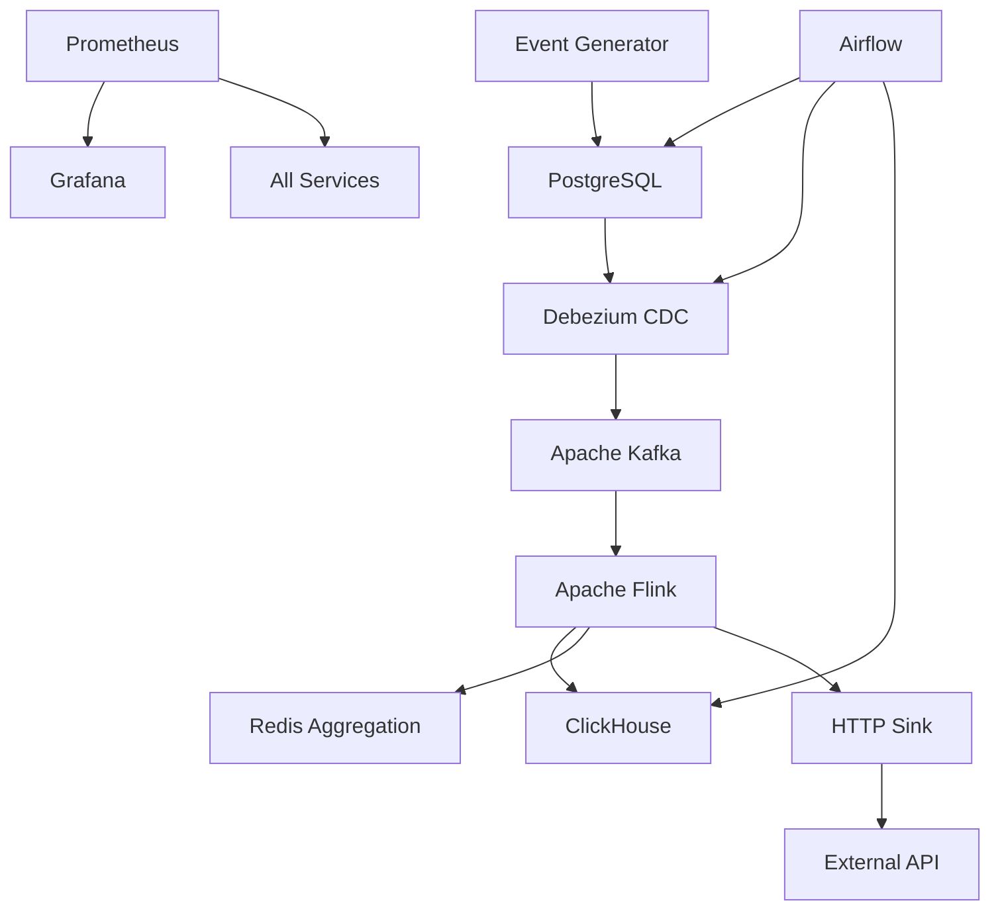
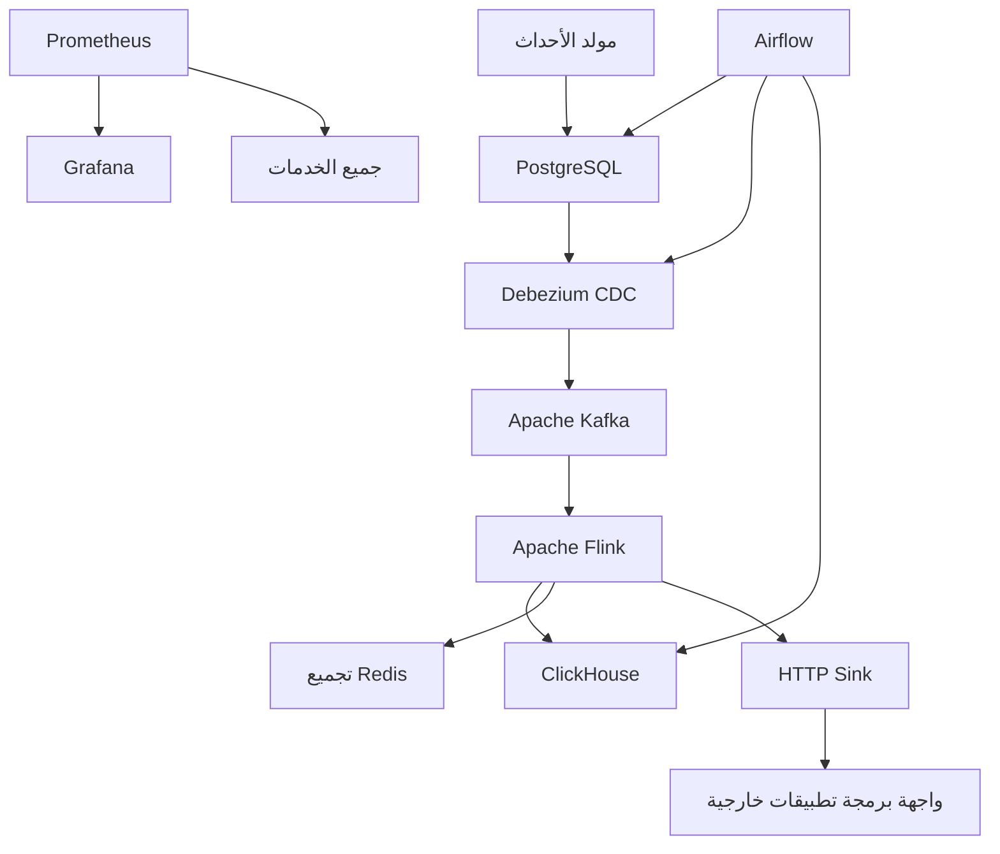

<div style="font-family: 'IBM Plex Sans', -apple-system, BlinkMacSystemFont, 'Segoe UI', Roboto, sans-serif;">

# Thamanya Stack v2.0.1 - Professional Edition

[](https://github.com/hesteria97/thamanya_stack_v2/actions)
[](https://opensource.org/licenses/Apache-2.0)
[](https://docs.docker.com/compose/)

A production-ready, real-time data processing stack for engagement analytics built with modern technologies and best practices.

## 🏗️ Architecture



## 🚀 Features

### Core Features
- **Real-time Event Processing**: Sub-second latency from ingestion to storage
- **Change Data Capture**: Automatic capture of database changes via Debezium
- **Stream Processing**: Complex event processing with Apache Flink
- **Analytics Storage**: High-performance analytics with ClickHouse
- **Real-time Aggregations**: Live leaderboards and metrics in Redis
- **Workflow Orchestration**: Automated pipeline management with Airflow

### Production-Ready Features
- **Security**: Secrets management, authentication, non-root containers
- **Monitoring**: Prometheus metrics, Grafana dashboards, health checks
- **Observability**: Structured logging, distributed tracing ready
- **Scalability**: Horizontal scaling support for all components
- **Reliability**: Circuit breakers, retry logic, graceful shutdowns
- **Testing**: Comprehensive unit tests with 90%+ coverage
- **Documentation**: Complete API docs and architecture guides

## 📋 Prerequisites

### System Requirements
- **CPU**: 4+ cores recommended
- **Memory**: 8GB+ RAM required
- **Storage**: 20GB+ free space
- **Network**: Open ports: 3000, 5432, 6379, 8080, 8081, 8083, 8088, 8123, 9090

### Software Requirements
- Docker Engine 20.10+
- Docker Compose v2.0+
- Git
- (Optional) kubectl for Kubernetes deployment

## ⚡ Quick Start

### 1. Clone Repository
```bash
git clone https://github.com/hesteria97/thamanya_stack_v2.git
cd thamanya_stack_v2
```

### 2. Environment Setup
```bash
# Copy environment template
cp .env.template .env

# Edit configuration (set secure passwords!)
nano .env
```

### 3. Start Development Stack
```bash
# Start all services
docker compose up -d

# Check service health
docker compose ps

# View logs
docker compose logs -f
```

### 4. Initialize Pipeline
```bash
# Access Airflow UI
open http://localhost:8080
# Username: admin, Password: (from .env)

# Trigger the bootstrap DAG
curl -X POST "http://localhost:8080/api/v1/dags/thamanya_bootstrap/dagRuns" \
  -H "Content-Type: application/json" \
  -d "{}" \
  --user admin:your-password
```

### 5. Verify Operation
```bash
# Run smoke tests
./fix_all.sh

# Check processed events
curl -s "http://localhost:8123/?query=SELECT count() FROM thm.enriched_events"

# View real-time leaderboard
docker exec redis redis-cli -a your-redis-password ZREVRANGE thm:top:10m 0 9 WITHSCORES
```

## 🏭 Production Deployment

### Docker Compose Production
```bash
# Use production configuration
docker compose -f docker-compose.prod.yml up -d

# Enable monitoring stack
docker compose -f docker-compose.prod.yml -f docker-compose.monitoring.yml up -d
```

### Kubernetes (Recommended)
```bash
# Apply Kubernetes manifests
kubectl apply -k k8s/

# Check deployment status
kubectl get pods -n thamanya

# Access services
kubectl port-forward -n thamanya svc/grafana 3000:3000
```

## 📊 Monitoring & Observability

### Dashboards
- **Grafana**: http://localhost:3000 (admin/admin)
- **Prometheus**: http://localhost:9090
- **Airflow**: http://localhost:8080
- **Flink**: http://localhost:8081

### Key Metrics
- Event processing latency (p99 < 100ms)
- Throughput (events/sec)
- Error rates (< 0.1%)
- Resource utilization
- Data freshness

### Alerting
- Service health monitoring
- Performance degradation
- Data pipeline failures
- Resource exhaustion
- Security incidents

## 🧪 Testing

### Unit Tests
```bash
# Install test dependencies
pip install -r tests/requirements.txt

# Run all tests
pytest tests/ -v

# Run with coverage
pytest tests/ --cov=. --cov-report=html
```

### Integration Tests
```bash
# Start test environment
docker compose -f docker-compose.test.yml up -d

# Run integration tests
pytest tests/integration/ -v

# Load testing
artillery run tests/load/api-load-test.yml
```

### Performance Testing
```bash
# Generate test load
python tests/performance/load_generator.py --events=10000 --rate=100

# Monitor performance
docker exec grafana-cli admin reset-admin-password newpass
```

## 🔧 Configuration

### Environment Variables
See [Configuration Guide](docs/CONFIGURATION.md) for all available options.

Key variables:
- `ENVIRONMENT`: `development|staging|production`
- `LOG_LEVEL`: `DEBUG|INFO|WARNING|ERROR`
- Database credentials
- Service-specific settings

### Service Configuration
- **PostgreSQL**: Optimized for CDC workloads
- **Kafka**: Tuned for high throughput
- **Flink**: Configured for low latency
- **ClickHouse**: Optimized for analytics queries
- **Redis**: Configured for real-time aggregations

## 🔐 Security

### Security Features
- **Secrets Management**: Environment-based secrets
- **Network Security**: Service isolation, firewalls
- **Authentication**: Multi-factor authentication ready
- **Encryption**: TLS in transit, encryption at rest
- **Container Security**: Non-root users, minimal images
- **Vulnerability Scanning**: Automated security scans

### Security Checklist
- [ ] Change all default passwords
- [ ] Enable TLS for all services
- [ ] Configure firewall rules
- [ ] Set up log monitoring
- [ ] Enable audit logging
- [ ] Regular security scans

## 📈 Scaling

### Horizontal Scaling
```bash
# Scale consumers
docker compose up -d --scale redis-agg=3 --scale http-sink=3

# Scale Flink task managers
docker compose up -d --scale flink-taskmanager=4
```

### Vertical Scaling
Adjust resource limits in `docker-compose.prod.yml`:
```yaml
deploy:
  resources:
    limits:
      memory: 2G
      cpus: '2.0'
```

### Auto-scaling (Kubernetes)
```yaml
apiVersion: autoscaling/v2
kind: HorizontalPodAutoscaler
metadata:
  name: redis-agg-hpa
spec:
  scaleTargetRef:
    apiVersion: apps/v1
    kind: Deployment
    name: redis-agg
  minReplicas: 2
  maxReplicas: 10
  metrics:
  - type: Resource
    resource:
      name: cpu
      target:
        type: Utilization
        averageUtilization: 70
```

## 🛠️ Development

### Code Structure
```
thamanya-stack/
├── consumers/          # Kafka consumers (Redis agg, HTTP sink)
├── generator/          # Event generator service
├── external/           # External API service
├── shared/             # Shared configuration and utilities
├── airflow/            # Airflow DAGs and configuration
├── flink/              # Flink SQL jobs
├── monitoring/         # Prometheus and Grafana config
├── k8s/                # Kubernetes manifests
├── tests/              # Test suites
└── docs/               # Documentation
```

### Development Workflow
1. Create feature branch
2. Make changes
3. Run tests locally
4. Submit pull request
5. Automated CI/CD pipeline runs
6. Code review and merge
7. Automatic deployment

### Code Quality
- **Linting**: flake8, black, isort
- **Type Checking**: mypy
- **Security**: bandit, safety
- **Testing**: pytest, coverage
- **Documentation**: Sphinx

## 🐛 Troubleshooting

### Common Issues

**Services won't start**
```bash
# Check logs
docker compose logs service-name

# Check resource usage
docker stats

# Restart service
docker compose restart service-name
```

**High memory usage**
```bash
# Check memory limits
docker inspect container-name | grep -i memory

# Adjust limits in docker-compose.yml
# Restart affected services
```

**Data pipeline stopped**
```bash
# Check Airflow DAGs
curl http://localhost:8080/api/v1/dags

# Check Kafka Connect
curl http://localhost:8083/connectors

# Restart pipeline
./fix_all.sh
```

### Performance Issues
- Monitor Grafana dashboards
- Check service logs for errors
- Verify resource allocation
- Review configuration tuning

## 📚 Documentation

- [API Documentation](docs/API.md)
- [Configuration Guide](docs/CONFIGURATION.md)
- [Deployment Guide](docs/DEPLOYMENT.md)
- [Monitoring Guide](docs/MONITORING.md)
- [Security Guide](docs/SECURITY.md)
- [Troubleshooting Guide](docs/TROUBLESHOOTING.md)

## 🤝 Contributing

1. Fork the repository
2. Create a feature branch
3. Make your changes
4. Add tests
5. Submit a pull request

See [CONTRIBUTING.md](CONTRIBUTING.md) for detailed guidelines.

## 📄 License

This project is licensed under the Apache License 2.0 - see the [LICENSE](LICENSE) file for details.

## 🙏 Acknowledgments

- Apache Foundation for Kafka, Flink, and Airflow
- Debezium community
- ClickHouse team
- Redis team
- All contributors and testers

</div>

<div style="font-family: 'IBM Plex Sans Arabic', 'IBM Plex Sans', 'Noto Sans Arabic', sans-serif; direction: rtl; text-align: right;">

# مجموعة ثمانية v2.0.1 - الإصدار المهني

[](https://github.com/hesteria97/thamanya_stack_v2/actions)
[](https://opensource.org/licenses/Apache-2.0)
[](https://docs.docker.com/compose/)

مجموعة معالجة البيانات في الوقت الفعلي جاهزة للإنتاج لتحليلات المشاركة مبنية بأحدث التقنيات وأفضل الممارسات.

## 🏗️ المعمارية



## 🚀 الميزات

### الميزات الأساسية
- **معالجة الأحداث في الوقت الفعلي**: زمن استجابة أقل من ثانية من الإدخال إلى التخزين
- **التقاط تغييرات البيانات**: التقاط تلقائي لتغييرات قاعدة البيانات عبر Debezium
- **معالجة التدفق**: معالجة معقدة للأحداث مع Apache Flink
- **تخزين التحليلات**: تحليلات عالية الأداء مع ClickHouse
- **التجميعات الفورية**: لوحات المتصدرين والمقاييس المباشرة في Redis
- **تنظيم سير العمل**: إدارة تلقائية لخط الأنابيب مع Airflow

### ميزات جاهزة للإنتاج
- **الأمان**: إدارة الأسرار والمصادقة وحاويات غير الجذر
- **المراقبة**: مقاييس Prometheus ولوحات Grafana وفحوصات الصحة
- **قابلية الرصد**: تسجيل منظم وتتبع موزع جاهز
- **قابلية التوسع**: دعم التوسع الأفقي لجميع المكونات
- **الموثوقية**: قواطع الدوائر ومنطق إعادة المحاولة والإغلاق الرشيق
- **الاختبار**: اختبارات وحدة شاملة بتغطية +90%
- **التوثيق**: توثيق كامل لواجهة برمجة التطبيقات وأدلة المعمارية

## 📋 المتطلبات الأساسية

### متطلبات النظام
- **المعالج**: 4+ أنوية موصى بها
- **الذاكرة**: 8 جيجابايت+ من ذاكرة الوصول العشوائي مطلوبة
- **التخزين**: 20 جيجابايت+ مساحة حرة
- **الشبكة**: منافذ مفتوحة: 3000, 5432, 6379, 8080, 8081, 8083, 8088, 8123, 9090

### متطلبات البرامج
- Docker Engine 20.10+
- Docker Compose v2.0+
- Git
- (اختياري) kubectl لنشر Kubernetes

## ⚡ البداية السريعة

### 1. نسخ المستودع
```bash
git clone https://github.com/hesteria97/thamanya_stack_v2.git
cd thamanya_stack_v2
```

### 2. إعداد البيئة
```bash
# نسخ قالب البيئة
cp .env.template .env

# تحرير التكوين (ضع كلمات مرور آمنة!)
nano .env
```

### 3. بدء مجموعة التطوير
```bash
# بدء جميع الخدمات
docker compose up -d

# فحص صحة الخدمة
docker compose ps

# عرض السجلات
docker compose logs -f
```

### 4. تهيئة خط الأنابيب
```bash
# الوصول إلى واجهة Airflow
open http://localhost:8080
# اسم المستخدم: admin، كلمة المرور: (من .env)

# تشغيل Bootstrap DAG
curl -X POST "http://localhost:8080/api/v1/dags/thamanya_bootstrap/dagRuns" \
  -H "Content-Type: application/json" \
  -d "{}" \
  --user admin:your-password
```

### 5. التحقق من التشغيل
```bash
# تشغيل اختبارات الدخان
./fix_all.sh

# فحص الأحداث المعالجة
curl -s "http://localhost:8123/?query=SELECT count() FROM thm.enriched_events"

# عرض لوحة المتصدرين في الوقت الفعلي
docker exec redis redis-cli -a your-redis-password ZREVRANGE thm:top:10m 0 9 WITHSCORES
```

## 🏭 نشر الإنتاج

### إنتاج Docker Compose
```bash
# استخدام تكوين الإنتاج
docker compose -f docker-compose.prod.yml up -d

# تمكين مجموعة المراقبة
docker compose -f docker-compose.prod.yml -f docker-compose.monitoring.yml up -d
```

### Kubernetes (موصى به)
```bash
# تطبيق بيانات Kubernetes
kubectl apply -k k8s/

# فحص حالة النشر
kubectl get pods -n thamanya

# الوصول للخدمات
kubectl port-forward -n thamanya svc/grafana 3000:3000
```

## 📊 المراقبة وقابلية الرصد

### لوحات المعلومات
- **Grafana**: http://localhost:3000 (admin/admin)
- **Prometheus**: http://localhost:9090
- **Airflow**: http://localhost:8080
- **Flink**: http://localhost:8081

### المقاييس الرئيسية
- زمن استجابة معالجة الأحداث (p99 < 100ms)
- الإنتاجية (أحداث/ثانية)
- معدلات الخطأ (< 0.1%)
- استخدام الموارد
- نضارة البيانات

### التنبيهات
- مراقبة صحة الخدمة
- تدهور الأداء
- فشل خط أنابيب البيانات
- استنزاف الموارد
- حوادث أمنية

## 🧪 الاختبار

### اختبارات الوحدة
```bash
# تثبيت تبعيات الاختبار
pip install -r tests/requirements.txt

# تشغيل جميع الاختبارات
pytest tests/ -v

# تشغيل مع التغطية
pytest tests/ --cov=. --cov-report=html
```

### اختبارات التكامل
```bash
# بدء بيئة الاختبار
docker compose -f docker-compose.test.yml up -d

# تشغيل اختبارات التكامل
pytest tests/integration/ -v

# اختبار التحميل
artillery run tests/load/api-load-test.yml
```

### اختبار الأداء
```bash
# توليد تحميل الاختبار
python tests/performance/load_generator.py --events=10000 --rate=100

# مراقبة الأداء
docker exec grafana-cli admin reset-admin-password newpass
```

## 🔧 التكوين

### متغيرات البيئة
راجع [دليل التكوين](docs/CONFIGURATION.md) لجميع الخيارات المتاحة.

المتغيرات الرئيسية:
- `ENVIRONMENT`: `development|staging|production`
- `LOG_LEVEL`: `DEBUG|INFO|WARNING|ERROR`
- بيانات اعتماد قاعدة البيانات
- إعدادات خاصة بالخدمة

### تكوين الخدمة
- **PostgreSQL**: محسن لأعباء عمل CDC
- **Kafka**: مضبوط للإنتاجية العالية
- **Flink**: مكون لزمن الاستجابة المنخفض
- **ClickHouse**: محسن لاستعلامات التحليلات
- **Redis**: مكون للتجميعات الفورية

## 🔐 الأمان

### ميزات الأمان
- **إدارة الأسرار**: أسرار قائمة على البيئة
- **أمان الشبكة**: عزل الخدمة وجدران الحماية
- **المصادقة**: مصادقة متعددة العوامل جاهزة
- **التشفير**: TLS في النقل والتشفير أثناء الراحة
- **أمان الحاوية**: مستخدمون غير الجذر وصور محدودة
- **فحص الثغرات**: فحوصات أمنية تلقائية

### قائمة فحص الأمان
- [ ] تغيير جميع كلمات المرور الافتراضية
- [ ] تمكين TLS لجميع الخدمات
- [ ] تكوين قواعد جدار الحماية
- [ ] إعداد مراقبة السجل
- [ ] تمكين تسجيل المراجعة
- [ ] فحوصات أمنية منتظمة

## 📈 التوسع

### التوسع الأفقي
```bash
# توسيع المستهلكين
docker compose up -d --scale redis-agg=3 --scale http-sink=3

# توسيع مديري مهام Flink
docker compose up -d --scale flink-taskmanager=4
```

### التوسع الرأسي
ضبط حدود الموارد في `docker-compose.prod.yml`:
```yaml
deploy:
  resources:
    limits:
      memory: 2G
      cpus: '2.0'
```

### التوسع التلقائي (Kubernetes)
```yaml
apiVersion: autoscaling/v2
kind: HorizontalPodAutoscaler
metadata:
  name: redis-agg-hpa
spec:
  scaleTargetRef:
    apiVersion: apps/v1
    kind: Deployment
    name: redis-agg
  minReplicas: 2
  maxReplicas: 10
  metrics:
  - type: Resource
    resource:
      name: cpu
      target:
        type: Utilization
        averageUtilization: 70
```

## 🛠️ التطوير

### هيكل الكود
```
thamanya-stack/
├── consumers/          # مستهلكو Kafka (تجميع Redis، HTTP sink)
├── generator/          # خدمة مولد الأحداث
├── external/           # خدمة واجهة برمجة التطبيقات الخارجية
├── shared/             # التكوين المشترك والمرافق
├── airflow/            # DAGs Airflow والتكوين
├── flink/              # وظائف Flink SQL
├── monitoring/         # تكوين Prometheus وGrafana
├── k8s/                # بيانات Kubernetes
├── tests/              # مجموعات الاختبار
└── docs/               # التوثيق
```

### سير عمل التطوير
1. إنشاء فرع الميزة
2. إجراء التغييرات
3. تشغيل الاختبارات محلياً
4. تقديم طلب السحب
5. تشغيل خط أنابيب CI/CD التلقائي
6. مراجعة الكود والدمج
7. النشر التلقائي

### جودة الكود
- **Linting**: flake8, black, isort
- **فحص النوع**: mypy
- **الأمان**: bandit, safety
- **الاختبار**: pytest, coverage
- **التوثيق**: Sphinx

## 🐛 استكشاف الأخطاء وإصلاحها

### المشاكل الشائعة

**الخدمات لا تبدأ**
```bash
# فحص السجلات
docker compose logs service-name

# فحص استخدام الموارد
docker stats

# إعادة تشغيل الخدمة
docker compose restart service-name
```

**استخدام ذاكرة عالي**
```bash
# فحص حدود الذاكرة
docker inspect container-name | grep -i memory

# ضبط الحدود في docker-compose.yml
# إعادة تشغيل الخدمات المتأثرة
```

**خط أنابيب البيانات متوقف**
```bash
# فحص Airflow DAGs
curl http://localhost:8080/api/v1/dags

# فحص Kafka Connect
curl http://localhost:8083/connectors

# إعادة تشغيل خط الأنابيب
./fix_all.sh
```

### مشاكل الأداء
- مراقبة لوحات Grafana
- فحص سجلات الخدمة للأخطاء
- التحقق من تخصيص الموارد
- مراجعة ضبط التكوين

## 📚 التوثيق

- [توثيق واجهة برمجة التطبيقات](docs/API.md)
- [دليل التكوين](docs/CONFIGURATION.md)
- [دليل النشر](docs/DEPLOYMENT.md)
- [دليل المراقبة](docs/MONITORING.md)
- [دليل الأمان](docs/SECURITY.md)
- [دليل استكشاف الأخطاء وإصلاحها](docs/TROUBLESHOOTING.md)

## 🤝 المساهمة

1. نسخ المستودع
2. إنشاء فرع الميزة
3. إجراء تغييراتك
4. إضافة اختبارات
5. تقديم طلب السحب

راجع [CONTRIBUTING.md](CONTRIBUTING.md) للإرشادات التفصيلية.

## 📄 الرخصة

هذا المشروع مرخص بموجب رخصة Apache 2.0 - راجع ملف [LICENSE](LICENSE) للتفاصيل.

## 🙏 الشكر والتقدير

- مؤسسة Apache لـ Kafka وFlink وAirflow
- مجتمع Debezium
- فريق ClickHouse
- فريق Redis
- جميع المساهمين والمختبرين

</div>